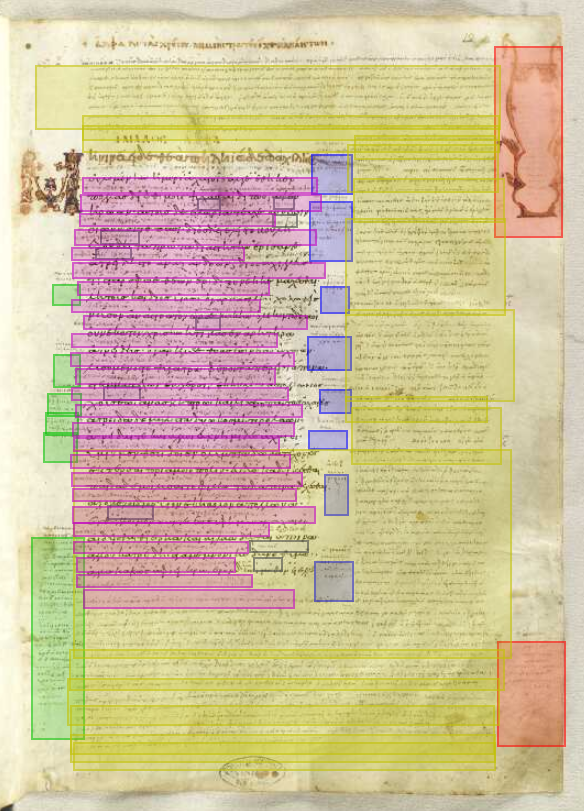

## Multitextual editing and reading: two manuscripts of the *Iliad* ##

---

## A multitextual understanding of the *Iliad* ##

- Variety of the oral tradition reduced in written transmission
- Evidence for earlier multiforms preserved in scholarly notes (*scholia*)

---

## The Venetus A manuscript ##

- earliest complete manuscript of the *Iliad* (10th c.)
- today in Venice
- important for its distinct scholia

[va126r]: imgs/va-126r.jpg

---

## Escorial, Upsilon 1.1 ##

- 11th century
- today in Escorial Monastery in Spain
- Large-format MS with scholia, content largely distinct from Venetus A

[zoom123v124r]: http://beta.hpcc.uh.edu/tomcat/hmtcite/images?request=GetIIPMooViewer&urn=urn:cite:hmt:e3bifolio.E3_123v_124r

[![Escorial, Upsilon 1.1][E3-123v-124r]][zoom123v124r]

[E3-123v-124r]: imgs/e3-123v-124r.jpg

---

## The "Total Editing" Process ##

- digital representation of every observed feature
- diplomatic digital edition
- text indexed to images
- understanding the manuscript layout

---

## Understanding the Venetus A

- distinct sets of scholia
- *main* scholia keyed by lemmata
- critical signs flagging lines with comment

[vena]: imgs/scholia-ven-a.png

---

## Editing Upsilon 1.1 ##

- layout for bifolio spread
- scholia continuously numbered from verso to recto

![Escorial, Upsilon 1.1][E3-123v-124r]

[E3-123v-124r]: imgs/e3-123v-124r.jpg

---

## Editing the text ##

- main Iliadic text
- scholia
- citing visual source material

---

![x][raw]

![x][pointy]

![x][authormode]

[raw]: imgs/raw.jpg

[pointy]: imgs/pointy.jpg

[authormode]: imgs/authormode.jpg

[ox]: imgs/oxygen.png

---

## Some  multitextual readings in *Iliad* 10 ##

---

## Overlapping content in Venetus A ##

Two comments on *Iliad* 10.13:

> 12 θαύμαζεν πυρὰ πολλὰ τὰ καίετο Ἰλιόθι πρὸ
> 
> 13 αὐλῶν συρίγγων τ᾽ ἐνοπὴν ὅμαδόν τ᾽ ἀνθρώπων.
> 
> He marvelled at ... the sound of the flutes and pipes ...

---

## Main scholion

Commenting on "the sound of flutes and pipes": There should be a short break after the phrase "sound ... of the flutes"

[![Main-brachu][brachu]][zoom1]

[brachu]: imgs/main-brachu.jpg

[zoom1]: http://beta.hpcc.uh.edu/tomcat/hmtcite/images?request=GetIIPMooViewer&urn=urn:cite:hmt:vaimg.VA126RN-0298@0.127,0.7082,0.687,0.0495

<blockquote>ὅτι ἐνθάδε καὶ ἐπι τῆς ὁπλοποιϊας τῶν αὐλῶν μέμνηται. αὐλοὶ φόρμιγγές τε βοῶν. δεῖ δὲ καὶ τὸ ἀκούων προσ ὑπακούειν ἔξωθεν βράχυ δὲ διασταλτέον μετὰ τὸ αὐλῶν ἐνοπήν, ἐσημειώσατο δὲ δια τοῦ ἤχου ὅτι παρα τοῖς βαρβάροις ἐγινώσκετο τὸ ὄργανα ταῦτα⁑</blockquote>

---

## Interior scholion

[![interior scholion][int]][zoom2]

[int]: imgs/126r-int.jpg

<blockquote>βραχὺ διασταλτέον μετὰ τὸ αὐλῶν καὶ ἐνοπήν.</blockquote>

There should be a short break after the phrase "sound ... of the flutes"

[zoom2]: http://beta.hpcc.uh.edu/tomcat/hmtcite/images?request=GetIIPMooViewer&urn=urn:cite:hmt:vaimg.VA126RN-0298@0.106,0.4359,0.073,0.0405

---

## Composition or compression? ##

Main:
<blockquote>ὅτι ἐνθάδε καὶ ἐπι τῆς ὁπλοποιϊας τῶν αὐλῶν μέμνηται. αὐλοὶ φόρμιγγές τε βοῶν. δεῖ δὲ καὶ τὸ ἀκούων προσ ὑπακούειν ἔξωθεν βράχυ δὲ διασταλτέον μετὰ τὸ αὐλῶν ἐνοπήν, ἐσημειώσατο δὲ δια τοῦ ἤχου ὅτι παρα τοῖς βαρβάροις ἐγινώσκετο τὸ ὄργανα ταῦτα⁑</blockquote>

Interior:
<blockquote>βραχὺ διασταλτέον μετὰ τὸ αὐλῶν καὶ ἐνοπήν.</blockquote>

---

## Overlapping content across manuscripts ##

[![nukt in va][va10-1]][ven10schol1]

>  αὔτη ἡ ραψωδία, ἐπιγράφεται νυκτεγερσία
>    
>  This rhapsody (book) is entitled "The Night Waking"

[ven10schol1]: http://beta.hpcc.uh.edu/tomcat/hmtcite/images?request=GetIIPMooViewer&urn=urn:cite:hmt:vaimg.VA126RN-0298@0.158,0.087,0.299,0.024

---

## Secondary scholia in Upsilon 1.1 ##

- one or more hands (12-15th centuries?)
- more overlap with Venetus A contents than previously suspected?

---

## Secondary hand in Upsilon 1.1

[![in ups 1.1][ups-nukt]][ups-nukt-zoom]

> ἡ παροῦσα ῥαψωδία δὲ νυκτεγερσία κα[...]
> 
> The present rhapsody [is called?] "The Night Waking"

[ups-nukt-zoom]: http://beta.hpcc.uh.edu/tomcat/hmtcite/images?request=GetIIPMooViewer&urn=urn:cite:hmt:e3bifolio.E3_123v_124r@0.727,0.6201,0.113,0.021

[va10-1]: imgs/vena-il10-firstschol.jpg

[ups-nukt]: imgs/ups-nukt.jpg

---

## Conclusion ##

---
<!-- 
![venametin][metin]

![intermarginal][intermarg]
-->
[metin]: imgs/main-metin.jpg

[intermarg]: imgs/intermarg.jpg

